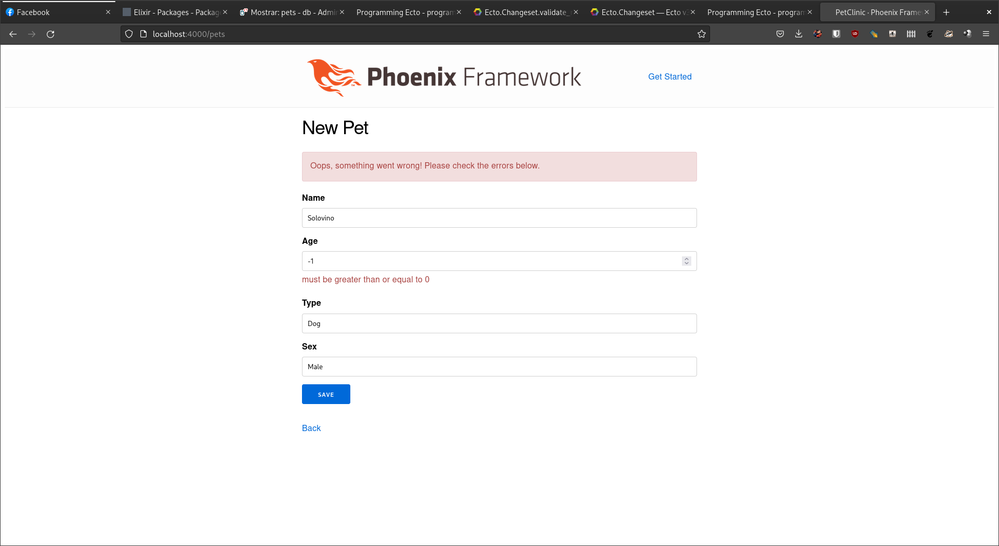

# Consultar 2 pets con la asociación hacia owner precargada.

iex(10)> smaug = Repo.get!(Pet, 4) |> Repo.preload(:owner) 
[debug] QUERY OK source="pets" db=3.5ms idle=1997.2ms
SELECT p0."id", p0."age", p0."name", p0."sex", p0."type", p0."owner_id", p0."inserted_at", p0."updated_at" FROM "pets" AS p0 WHERE (p0."id" = $1) [4]
%PetClinic.PetClinicPets.Pet{
  __meta__: #Ecto.Schema.Metadata<:loaded, "pets">,
  age: 99999,
  id: 4,
  inserted_at: ~N[2022-04-20 15:36:45],
  name: "Smaug",
  owner: nil,
  owner_id: nil,
  sex: "Male",
  type: "Dragon",
  updated_at: ~N[2022-04-20 15:36:45]
}

iex(14)> pet3 = Repo.get!(Pet, 3) |> Repo.preload(:owner)
[debug] QUERY OK source="pets" db=1.0ms idle=1061.3ms
SELECT p0."id", p0."age", p0."name", p0."sex", p0."type", p0."owner_id", p0."inserted_at", p0."updated_at" FROM "pets" AS p0 WHERE (p0."id" = $1) [3]
%PetClinic.PetClinicPets.Pet{
  __meta__: #Ecto.Schema.Metadata<:loaded, "pets">,
  age: 3,
  id: 3,
  inserted_at: ~N[2022-04-20 15:36:26],
  name: "Skye",
  owner: nil,
  owner_id: nil,
  sex: "Female",
  type: "Dog",
  updated_at: ~N[2022-04-20 15:36:26]
  }

------------------------------------------------------------------------------------------------------------------------------------------------------

# Usando put_assoc, asociar c/u de esos pets con algún owner.

iex(8)> owner1 =Repo.get(Owner, 1)
[debug] QUERY OK source="owners" db=1.2ms idle=1068.8ms
SELECT o0."id", o0."age", o0."email", o0."name", o0."phone_num", o0."inserted_at", o0."updated_at" FROM "owners" AS o0 WHERE (o0."id" = $1) [1]
%PetClinic.PetClinicPetOwner.Owner{
  __meta__: #Ecto.Schema.Metadata<:loaded, "owners">,
  age: 26,
  email: "charlotte@mail.com",
  id: 1,
  inserted_at: ~N[2022-04-21 02:48:10],
  name: "Charlotte C. Stetson",
  pets: #Ecto.Association.NotLoaded<association :pets is not loaded>,
  phone_num: "229-623-3452",
  updated_at: ~N[2022-04-21 02:48:10]
}

iex(11)> cgown = smaug |> change() |> put_assoc(:owner, owner1)  
#Ecto.Changeset<
  action: nil,
  changes: %{
    owner: #Ecto.Changeset<action: :update, changes: %{}, errors: [],
     data: #PetClinic.PetClinicPetOwner.Owner<>, valid?: true>
  },
  errors: [],
  data: #PetClinic.PetClinicPets.Pet<>,
  valid?: true
>

iex(12)> Repo.update(cgown)
[debug] QUERY OK db=0.7ms idle=579.1ms
begin []
[debug] QUERY OK db=1.6ms
UPDATE "pets" SET "owner_id" = $1, "updated_at" = $2 WHERE "id" = $3 [1, ~N[2022-04-21 03:16:28], 4]
[debug] QUERY OK db=0.9ms
commit []
{:ok,
 %PetClinic.PetClinicPets.Pet{
   __meta__: #Ecto.Schema.Metadata<:loaded, "pets">,
   age: 99999,
   id: 4,
   inserted_at: ~N[2022-04-20 15:36:45],
   name: "Smaug",
   owner: %PetClinic.PetClinicPetOwner.Owner{
     __meta__: #Ecto.Schema.Metadata<:loaded, "owners">,
     age: 26,
     email: "charlotte@mail.com",
     id: 1,
     inserted_at: ~N[2022-04-21 02:48:10],
     name: "Charlotte C. Stetson",
     pets: #Ecto.Association.NotLoaded<association :pets is not loaded>,
     phone_num: "229-623-3452",
     updated_at: ~N[2022-04-21 02:48:10]
   },
   owner_id: 1,
   sex: "Male",
   type: "Dragon",
   updated_at: ~N[2022-04-21 03:16:28]
 }}

iex(15)> owner2 = Repo.get(Owner, 2)      
[debug] QUERY OK source="owners" db=0.5ms idle=1434.0ms
SELECT o0."id", o0."age", o0."email", o0."name", o0."phone_num", o0."inserted_at", o0."updated_at" FROM "owners" AS o0 WHERE (o0."id" = $1) [2]
%PetClinic.PetClinicPetOwner.Owner{
  __meta__: #Ecto.Schema.Metadata<:loaded, "owners">,
  age: 29,
  email: "john@mail.com",
  id: 2,
  inserted_at: ~N[2022-04-21 02:48:47],
  name: "John C. Stewart",
  pets: #Ecto.Association.NotLoaded<association :pets is not loaded>,
  phone_num: "201-729-7767",
  updated_at: ~N[2022-04-21 02:48:47]
}

iex(17)> cgown = pet3 |> change() |> put_assoc(:owner, owner2) 
#Ecto.Changeset<
  action: nil,
  changes: %{
    owner: #Ecto.Changeset<action: :update, changes: %{}, errors: [],
     data: #PetClinic.PetClinicPetOwner.Owner<>, valid?: true>
  },
  errors: [],
  data: #PetClinic.PetClinicPets.Pet<>,
  valid?: true
>

iex(18)> Repo.update(cgown)                                   
[debug] QUERY OK db=0.7ms idle=1247.0ms
begin []
[debug] QUERY OK db=1.7ms
UPDATE "pets" SET "owner_id" = $1, "updated_at" = $2 WHERE "id" = $3 [2, ~N[2022-04-21 03:18:48], 3]
[debug] QUERY OK db=0.9ms
commit []
{:ok,
 %PetClinic.PetClinicPets.Pet{
   __meta__: #Ecto.Schema.Metadata<:loaded, "pets">,
   age: 3,
   id: 3,
   inserted_at: ~N[2022-04-20 15:36:26],
   name: "Skye",
   owner: %PetClinic.PetClinicPetOwner.Owner{
     __meta__: #Ecto.Schema.Metadata<:loaded, "owners">,
     age: 29,
     email: "john@mail.com",
     id: 2,
     inserted_at: ~N[2022-04-21 02:48:47],
     name: "John C. Stewart",
     pets: #Ecto.Association.NotLoaded<association :pets is not loaded>,
     phone_num: "201-729-7767",
     updated_at: ~N[2022-04-21 02:48:47]
   },
   owner_id: 2,
   sex: "Female",
   type: "Dog",
   updated_at: ~N[2022-04-21 03:18:48]
 }}

-----------------------------------------------------------------------------------------------------------------------------------------------------------

# Consultar el owner anterior, precargando la asociación con pets.

iex(20)> smaug = Repo.get!(Pet, 4) |> Repo.preload(:owner)
[debug] QUERY OK source="pets" db=0.5ms idle=1829.6ms
SELECT p0."id", p0."age", p0."name", p0."sex", p0."type", p0."owner_id", p0."inserted_at", p0."updated_at" FROM "pets" AS p0 WHERE (p0."id" = $1) [4]
[debug] QUERY OK source="owners" db=0.3ms idle=1830.3ms
SELECT o0."id", o0."age", o0."email", o0."name", o0."phone_num", o0."inserted_at", o0."updated_at", o0."id" FROM "owners" AS o0 WHERE (o0."id" = $1) [1]
%PetClinic.PetClinicPets.Pet{
  __meta__: #Ecto.Schema.Metadata<:loaded, "pets">,
  age: 99999,
  id: 4,
  inserted_at: ~N[2022-04-20 15:36:45],
  name: "Smaug",
  owner: %PetClinic.PetClinicPetOwner.Owner{
    __meta__: #Ecto.Schema.Metadata<:loaded, "owners">,
    age: 26,
    email: "charlotte@mail.com",
    id: 1,
    inserted_at: ~N[2022-04-21 02:48:10],
    name: "Charlotte C. Stetson",
    pets: #Ecto.Association.NotLoaded<association :pets is not loaded>,
    phone_num: "229-623-3452",
    updated_at: ~N[2022-04-21 02:48:10]
  },
  owner_id: 1,
  sex: "Male",
  type: "Dragon",
  updated_at: ~N[2022-04-21 03:16:28]
}

iex(19)> pet3 = Repo.get!(Pet, 3) |> Repo.preload(:owner)     
[debug] QUERY OK source="pets" db=1.6ms idle=530.3ms
SELECT p0."id", p0."age", p0."name", p0."sex", p0."type", p0."owner_id", p0."inserted_at", p0."updated_at" FROM "pets" AS p0 WHERE (p0."id" = $1) [3]
[debug] QUERY OK source="owners" db=0.7ms queue=0.8ms idle=532.2ms
SELECT o0."id", o0."age", o0."email", o0."name", o0."phone_num", o0."inserted_at", o0."updated_at", o0."id" FROM "owners" AS o0 WHERE (o0."id" = $1) [2]
%PetClinic.PetClinicPets.Pet{
  __meta__: #Ecto.Schema.Metadata<:loaded, "pets">,
  age: 3,
  id: 3,
  inserted_at: ~N[2022-04-20 15:36:26],
  name: "Skye",
  owner: %PetClinic.PetClinicPetOwner.Owner{
    __meta__: #Ecto.Schema.Metadata<:loaded, "owners">,
    age: 29,
    email: "john@mail.com",
    id: 2,
    inserted_at: ~N[2022-04-21 02:48:47],
    name: "John C. Stewart",
    pets: #Ecto.Association.NotLoaded<association :pets is not loaded>,
    phone_num: "201-729-7767",
    updated_at: ~N[2022-04-21 02:48:47]
  },
  owner_id: 2,
  sex: "Female",
  type: "Dog",
  updated_at: ~N[2022-04-21 03:18:48]
}

----------------------------------------------------------------------------------------------------------------------------------------------------------

# Consultar 2 pets con la asociación hacia health_expert precargada.

iex(1)> pet1 = Repo.get!(Pet, 1) |> Repo.preload(:preferred_expert)
[debug] QUERY OK source="pets" db=7.1ms decode=1.6ms queue=0.6ms idle=1792.2ms
SELECT p0."id", p0."age", p0."name", p0."sex", p0."type", p0."owner_id", p0."health_expert_id", p0."inserted_at", p0."updated_at" FROM "pets" AS p0 WHERE (p0."id" = $1) [1]
%PetClinic.PetClinicPets.Pet{
  __meta__: #Ecto.Schema.Metadata<:loaded, "pets">,
  age: 2,
  health_expert_id: nil,
  id: 1,
  inserted_at: ~N[2022-04-20 15:33:57],
  name: "Rocky",
  owner: #Ecto.Association.NotLoaded<association :owner is not loaded>,
  owner_id: nil,
  preferred_expert: nil,
  sex: "Male",
  type: "Cat",
  updated_at: ~N[2022-04-20 15:48:43]
}

iex(2)> pet2 = Repo.get!(Pet, 3) |> Repo.preload(:preferred_expert)
[debug] QUERY OK source="pets" db=3.3ms idle=1278.1ms
SELECT p0."id", p0."age", p0."name", p0."sex", p0."type", p0."owner_id", p0."health_expert_id", p0."inserted_at", p0."updated_at" FROM "pets" AS p0 WHERE (p0."id" = $1) [3]
%PetClinic.PetClinicPets.Pet{
  __meta__: #Ecto.Schema.Metadata<:loaded, "pets">,
  age: 3,
  health_expert_id: nil,
  id: 3,
  inserted_at: ~N[2022-04-20 15:36:26],
  name: "Skye",
  owner: #Ecto.Association.NotLoaded<association :owner is not loaded>,
  owner_id: 2,
  preferred_expert: nil,
  sex: "Female",
  type: "Dog",
  updated_at: ~N[2022-04-21 03:18:48]
}

# Usando put_assoc, asociar c/u de esos pets con algún health expert.

iex(3)> expert1 = Repo.get(HealthExpert, 1)
[debug] QUERY OK source="health_experts" db=0.6ms queue=1.0ms idle=1189.4ms
SELECT h0."id", h0."age", h0."email", h0."name", h0."sex", h0."specialities", h0."inserted_at", h0."updated_at" FROM "health_experts" AS h0 WHERE (h0."id" = $1) [1]
%PetClinic.PetHealthExpert.HealthExpert{
  __meta__: #Ecto.Schema.Metadata<:loaded, "health_experts">,
  age: 27,
  email: "georgia@mail.com",
  id: 1,
  inserted_at: ~N[2022-04-20 18:58:15],
  name: "Georgia D. Arter",
  patients: #Ecto.Association.NotLoaded<association :patients is not loaded>,
  sex: "Female",
  specialities: "Reptiles",
  updated_at: ~N[2022-04-20 18:58:15]
}
iex(4)> expert2 = Repo.get(HealthExpert, 2)
[debug] QUERY OK source="health_experts" db=1.1ms idle=1493.1ms
SELECT h0."id", h0."age", h0."email", h0."name", h0."sex", h0."specialities", h0."inserted_at", h0."updated_at" FROM "health_experts" AS h0 WHERE (h0."id" = $1) [2]
%PetClinic.PetHealthExpert.HealthExpert{
  __meta__: #Ecto.Schema.Metadata<:loaded, "health_experts">,
  age: 31,
  email: "elsie@mail.com",
  id: 2,
  inserted_at: ~N[2022-04-20 18:58:51],
  name: "Elsie C. Smith",
  patients: #Ecto.Association.NotLoaded<association :patients is not loaded>,
  sex: "Female",
  specialities: "Dogs, Cats",
  updated_at: ~N[2022-04-20 18:58:51]
}

iex(5)> pet1 = pet1 |> Ecto.Changeset.change |> Ecto.Changeset.put_assoc(:preferred_expert, expert1)
#Ecto.Changeset<
  action: nil,
  changes: %{
    preferred_expert: #Ecto.Changeset<action: :update, changes: %{}, errors: [],
     data: #PetClinic.PetHealthExpert.HealthExpert<>, valid?: true>
  },
  errors: [],
  data: #PetClinic.PetClinicPets.Pet<>,
  valid?: true
>

iex(7)> pet2 = pet2 |> Ecto.Changeset.change |> Ecto.Changeset.put_assoc(:preferred_expert, expert2)
#Ecto.Changeset<
  action: nil,
  changes: %{
    preferred_expert: #Ecto.Changeset<action: :update, changes: %{}, errors: [],
     data: #PetClinic.PetHealthExpert.HealthExpert<>, valid?: true>
  },
  errors: [],
  data: #PetClinic.PetClinicPets.Pet<>,
  valid?: true
>

iex(14)> Repo.update(pet1)                                                                           
[debug] QUERY OK db=0.3ms idle=1015.3ms
begin []
[debug] QUERY OK db=0.6ms
UPDATE "pets" SET "health_expert_id" = $1, "updated_at" = $2 WHERE "id" = $3 [1, ~N[2022-04-21 16:13:22], 1]
[debug] QUERY OK db=8.2ms
commit []
{:ok,
 %PetClinic.PetClinicPets.Pet{
   __meta__: #Ecto.Schema.Metadata<:loaded, "pets">,
   age: 2,
   health_expert_id: 1,
   id: 1,
   inserted_at: ~N[2022-04-20 15:33:57],
   name: "Rocky",
   owner: #Ecto.Association.NotLoaded<association :owner is not loaded>,
   owner_id: nil,
   preferred_expert: %PetClinic.PetHealthExpert.HealthExpert{
     __meta__: #Ecto.Schema.Metadata<:loaded, "health_experts">,
     age: 27,
     email: "georgia@mail.com",
     id: 1,
     inserted_at: ~N[2022-04-20 18:58:15],
     name: "Georgia D. Arter",
     patients: #Ecto.Association.NotLoaded<association :patients is not loaded>,
     sex: "Female",
     specialities: "Reptiles",
     updated_at: ~N[2022-04-20 18:58:15]
   },
   sex: "Male",
   type: "Cat",
   updated_at: ~N[2022-04-21 16:13:22]
 }}

 iex(9)> Repo.update(pet2)
[debug] QUERY OK db=0.3ms idle=1871.0ms
begin []
[debug] QUERY OK db=0.7ms
UPDATE "pets" SET "health_expert_id" = $1, "updated_at" = $2 WHERE "id" = $3 [2, ~N[2022-04-21 16:10:15], 3]
[debug] QUERY OK db=0.5ms
commit []
{:ok,
 %PetClinic.PetClinicPets.Pet{
   __meta__: #Ecto.Schema.Metadata<:loaded, "pets">,
   age: 3,
   health_expert_id: 2,
   id: 3,
   inserted_at: ~N[2022-04-20 15:36:26],
   name: "Skye",
   owner: #Ecto.Association.NotLoaded<association :owner is not loaded>,
   owner_id: 2,
   preferred_expert: %PetClinic.PetHealthExpert.HealthExpert{
     __meta__: #Ecto.Schema.Metadata<:loaded, "health_experts">,
     age: 31,
     email: "elsie@mail.com",
     id: 2,
     inserted_at: ~N[2022-04-20 18:58:51],
     name: "Elsie C. Smith",
     patients: #Ecto.Association.NotLoaded<association :patients is not loaded>,
     sex: "Female",
     specialities: "Dogs, Cats",
     updated_at: ~N[2022-04-20 18:58:51]
   },
   sex: "Female",
   type: "Dog",
   updated_at: ~N[2022-04-21 16:10:15]
 }}

# Consultar el health expert anterior, precargando la asociación con pets.

iex(15)> pet1 = Repo.get!(Pet, 1) |> Repo.preload(:preferred_expert)                                 
[debug] QUERY OK source="pets" db=1.1ms idle=1897.1ms
SELECT p0."id", p0."age", p0."name", p0."sex", p0."type", p0."owner_id", p0."health_expert_id", p0."inserted_at", p0."updated_at" FROM "pets" AS p0 WHERE (p0."id" = $1) [1]
[debug] QUERY OK source="health_experts" db=2.0ms idle=1898.5ms
SELECT h0."id", h0."age", h0."email", h0."name", h0."sex", h0."specialities", h0."inserted_at", h0."updated_at", h0."id" FROM "health_experts" AS h0 WHERE (h0."id" = $1) [1]
%PetClinic.PetClinicPets.Pet{
  __meta__: #Ecto.Schema.Metadata<:loaded, "pets">,
  age: 2,
  health_expert_id: 1,
  id: 1,
  inserted_at: ~N[2022-04-20 15:33:57],
  name: "Rocky",
  owner: #Ecto.Association.NotLoaded<association :owner is not loaded>,
  owner_id: nil,
  preferred_expert: %PetClinic.PetHealthExpert.HealthExpert{
    __meta__: #Ecto.Schema.Metadata<:loaded, "health_experts">,
    age: 27,
    email: "georgia@mail.com",
    id: 1,
    inserted_at: ~N[2022-04-20 18:58:15],
    name: "Georgia D. Arter",
    patients: #Ecto.Association.NotLoaded<association :patients is not loaded>,
    sex: "Female",
    specialities: "Reptiles",
    updated_at: ~N[2022-04-20 18:58:15]
  },
  sex: "Male",
  type: "Cat",
  updated_at: ~N[2022-04-21 16:13:22]
}

iex(16)> pet2 = Repo.get!(Pet, 3) |> Repo.preload(:preferred_expert)
[debug] QUERY OK source="pets" db=1.0ms idle=1998.6ms
SELECT p0."id", p0."age", p0."name", p0."sex", p0."type", p0."owner_id", p0."health_expert_id", p0."inserted_at", p0."updated_at" FROM "pets" AS p0 WHERE (p0."id" = $1) [3]
[debug] QUERY OK source="health_experts" db=0.7ms idle=1000.3ms
SELECT h0."id", h0."age", h0."email", h0."name", h0."sex", h0."specialities", h0."inserted_at", h0."updated_at", h0."id" FROM "health_experts" AS h0 WHERE (h0."id" = $1) [2]
%PetClinic.PetClinicPets.Pet{
  __meta__: #Ecto.Schema.Metadata<:loaded, "pets">,
  age: 3,
  health_expert_id: 2,
  id: 3,
  inserted_at: ~N[2022-04-20 15:36:26],
  name: "Skye",
  owner: #Ecto.Association.NotLoaded<association :owner is not loaded>,
  owner_id: 2,
  preferred_expert: %PetClinic.PetHealthExpert.HealthExpert{
    __meta__: #Ecto.Schema.Metadata<:loaded, "health_experts">,
    age: 31,
    email: "elsie@mail.com",
    id: 2,
    inserted_at: ~N[2022-04-20 18:58:51],
    name: "Elsie C. Smith",
    patients: #Ecto.Association.NotLoaded<association :patients is not loaded>,
    sex: "Female",
    specialities: "Dogs, Cats",
    updated_at: ~N[2022-04-20 18:58:51]
  },
  sex: "Female",
  type: "Dog",
  updated_at: ~N[2022-04-21 16:10:15]
}

# En `Pet.changeset` agregar 1 validación para que la edad no sea menor a 0.

    def changeset(pet, attrs) do
      pet
      |> cast(attrs, [:name, :age, :type, :sex])
      |> validate_required([:name, :age, :type, :sex])
      |> validate_number(:age, greater_than_or_equal_to: 0)
    end    

